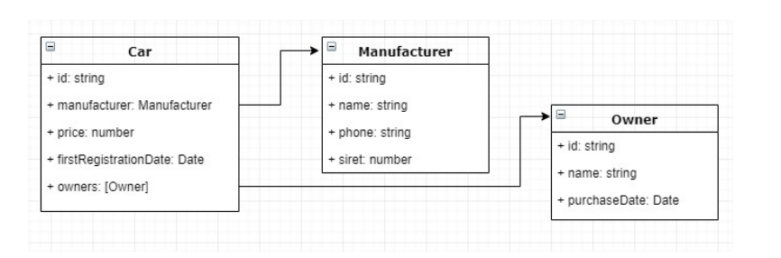

## Description

This project was realized with [Nest](https://github.com/nestjs/nest) framework.

This coding exercise consists in implementing a little backend micro-service which aims to serve the cars
data. 

This component will expose a REST api providing CRUD operations to fetch one or several cars, create,
update and delete a car. Though this api, it will also be possible: 

- Fetch only the manufacturer data for a given car (without any manufacturers dedicated APIs – i.e.
only by using the car API)
- To trigger a process which will automatically remove the owners who bought their cars before the last
18 months and apply a discount of 20% to all cars having a date of first registration between 12 and
18 months. 

The car data model will be kept relatively simple:



The application has to be configured to run in a Docker container. Moreover, the expected (and
mandatory) programming paradigm to respect is the OOP (oriented-object programming). 

The language to use will be Typescript and the framework Nestjs (https://nestjs.com/). 

## With Docker

Launch a script ./start.sh

```bash
$ ./start.sh
```


## Without Docker

Make sure that you change the configuration for DB (to your managed mongodb or your local mongodb). 

```bash
$ git clone ...
$ cd car-api
```

## Installation

```bash
$ npm install
```

## Running the app

```bash
# development
$ npm run start

# watch mode
$ npm run start:dev

# production mode
$ npm run start:prod
```

## Test

```bash
# unit tests
$ npm run test

# e2e tests
$ npm run test:e2e

# test coverage
$ npm run test:cov
```

## Postman 

You can also use postman to test API. 
The configuration is available at: 


```bash
$ ./postman/api-carpostman_collection.json
```